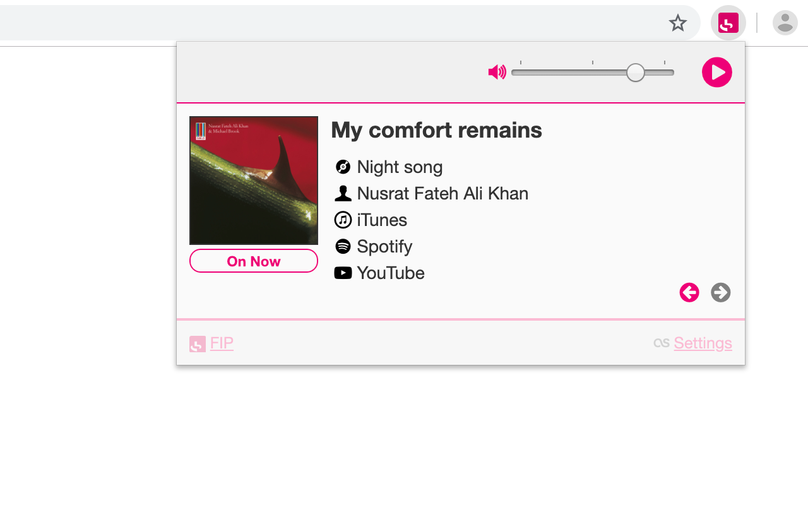

# FIP Radio — for Chrome, Firefox, Edge and Opera web browsers [![Build Status][]](https://travis-ci.org/oncletom/webextension-fip) ![][rating badge] ![][downloads badge] ![][version badge]

> *FIP Radio WebExtension* is a minimalistic browser interface to listen to [FIP Radio](https://www.fip.fr/), an eclectic and ad-free radio station. You can optionnally scrobble to your last.fm account.

I developed this extension to listen to my favourite radio station when [I moved from France to London](https://oncletom.io/2013/every-day-is-a-brand-new-place/).




# Features

| One-click playback, volume control and song preview | Get to know what aired previously |
| ---              | ---                 |
| ![][img-now]     | ![][img-history]    |


| Select a station | Scrobble to last.fm |
| ---              | ---                 |
| ![][img-stations]| ![][img-lastfm]     |

Oh, and it's **ads free** and **trackers free**.<br>
Check the [privacy policy](PRIVACY_POLICY.md) to know more how first-parties (aka. _not me_) may collect data about you.

# Install in your browser


You are **one click away** from installing the extension in your favourite web browser.
_FIP Radio WebExtension_ is distributed on the  official web stores:

* Firefox: [via Firefox Add-ons][Firefox extension]
* Chrome: [via the Chrome Web Store][Chrome extension]
* Opera: [via the Chrome Web Store][Chrome extension]
* Edge: [via the Chrome Web Store][Chrome extension]

Once installed, the radio playback is accessible by clicking on the FIP logo, freshly added to your browser.

That's it!

# Contribute

Contributions are friendly welcomed, either they are code, ideas or bug reports.

The developer toolchain relies on:
- [Angular](http://angularjs.org/) for dynamic HTML templating;
- [Machina.js](https://github.com/ifandelse/machina.js) for State Machine management;
- [WebExtensions API](https://developer.mozilla.org/en-US/docs/Mozilla/Add-ons/WebExtensions), to embed, run and distribute this browser extension.

If you don't know them much… well it's a good occasion to learn!

## Development Setup

Better for you to have [https://nodejs.org/download/](Node.js) (v10+) installed on your computer to use the development tooling.

Hit the `Clone or download` button above to get a copy of the source code. Then run these commands in a terminal:

```bash
$ npm install
$ npm run watch
```

Finally, load the unpacked extension ([in Chrome/Chromium](http://developer.chrome.com/extensions/getstarted.html#unpacked), [in Firefox](https://developer.mozilla.org/en-US/docs/Tools/about:debugging#Loading_a_temporary_add-on)). Changes will be taken in account immediatly — anything related to the _background_ page requires to reload/refresh the browser extension.

[Chrome Dev Tools](https://developers.google.com/chrome-developer-tools/) will
help you debugging by displaying errors or the various state change of the playback.

## Testing

Tests partially assert the code works as expected. You can check on your own:

```bash
$ npm test
```

If you don't think about it, no problem, tests are automated when you contribute back your code.

You will receive help and guidance if adding new tests is necessary.

Current status is pretty poor but the codebase is solid.

# Privacy Policy

[Read the end user privacy policy](PRIVACY_POLICY.md).

> tl;dr no data is collected.

# License

[MIT license](LICENSE).

[Chrome extension]: 	https://chrome.google.com/webstore/detail/fnhlecpfnocgmmmghkjcipmhdpmpddii
[Firefox extension]: https://addons.mozilla.org/firefox/addon/fip-radio/
[Build Status]: 	https://travis-ci.org/oncletom/webextension-fip.svg?branch=master
[downloads badge]: 	https://img.shields.io/chrome-web-store/d/fnhlecpfnocgmmmghkjcipmhdpmpddii.svg
[version badge]: 	https://img.shields.io/chrome-web-store/v/fnhlecpfnocgmmmghkjcipmhdpmpddii.svg
[rating badge]: 	https://img.shields.io/chrome-web-store/rating/fnhlecpfnocgmmmghkjcipmhdpmpddii.svg

[img-now]: resources/screenshots/popup-now-playing.png
[img-history]: resources/screenshots/popup-relative-buffering.png
[img-stations]: resources/screenshots/options-stations.png
[img-lastfm]: resources/screenshots/options-logged-in.png
