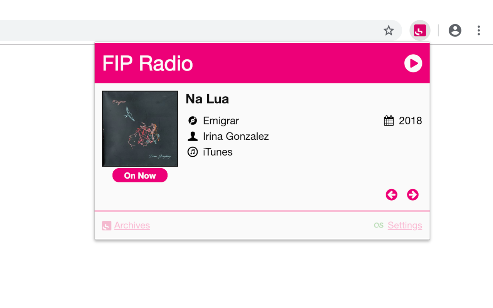
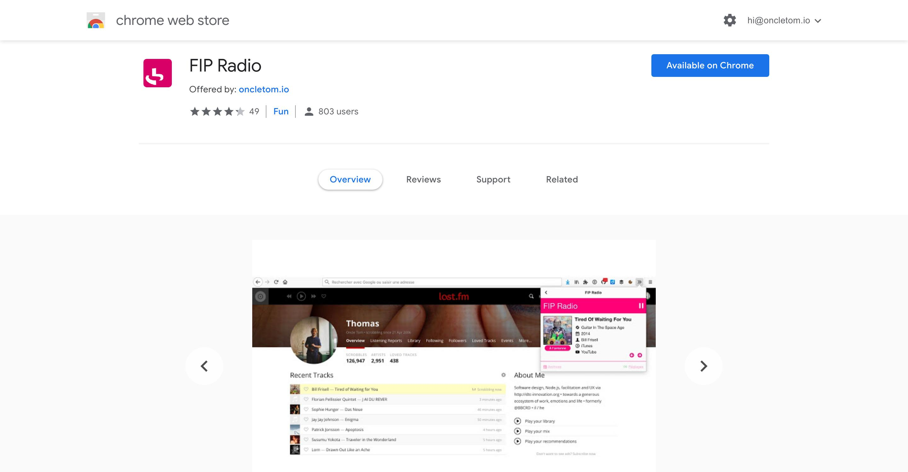

# FIP Radio Browser Extension [![Build Status][]](https://travis-ci.org/oncletom/chrome-fip) ![][rating badge] ![][downloads badge] ![][version badge]

> *FIP Radio Browser Extension* provides a minimalistic interface to listen to [FIP Radio](https://www.fip.fr/), an eclectic and ad-free radio station. You can optionnally scrobble to your last.fm account.



I developed this extension to listen to my favourite station in a single click, without popup.

It works in Google Chrome, Chromium, Mozilla Firefox and Opera browsers.

## Get Started

To use the extension, your first need to install it in your web browser:

* Chrome: [via the Chrome Web Store][Chrome extension]
* Firefox: [via Firefox Add-ons][Firefox extension]
* Opera: [via the Chrome Web Store][Chrome extension]

Once installed, the radio playback is accessible via the radio station logo, near your browser search bar.

That's it!



## Contribute

Contributions are friendly welcomed, either they are code, ideas or bug reports.

The developer toolchain relies on:
- [Angular](http://angularjs.org/) for dynamic HTML templating;
- [Machina.js](https://github.com/ifandelse/machina.js) for State Machine management;
- [WebExtensions API](https://developer.mozilla.org/en-US/docs/Mozilla/Add-ons/WebExtensions), to embed, run and distribute this browser extension.

If you don't know them much… well it's a good occasion to learn!

### Develop in your browser

Better for you to have [https://nodejs.org/download/](Node.js) (v10+) installed on your computer to use the development tooling.

Hit the `Clone or download` button above to get a copy of the source code. Then run these commands in a terminal:

```bash
$ npm install
$ npm run watch
```

Finally, load the unpacked extension ([in Chrome/Chromium](http://developer.chrome.com/extensions/getstarted.html#unpacked), [in Firefox](https://developer.mozilla.org/en-US/docs/Tools/about:debugging#Loading_a_temporary_add-on)). Changes will be taken in account immediatly — anything related to the _background_ page requires to reload/refresh the browser extension.

[Chrome Dev Tools](https://developers.google.com/chrome-developer-tools/) will
help you debugging by displaying errors or the various state change of the playback.

### Testing

Tests partially assert the code works as expected. You can check on your own:

```bash
$ npm test
```

If you don't think about it, no problem, tests are automated when you contribute back your code.

You will receive help and guidance if adding new tests is necessary.

Current status is pretty poor but the codebase is solid.

# Privacy Policy

[Read the end user privacy policy](PRIVACY_POLICY.md).

> tl;dr no data is collected.

# License

[MIT license](LICENSE).

[Chrome extension]: 	https://chrome.google.com/webstore/detail/fnhlecpfnocgmmmghkjcipmhdpmpddii
[Firefox extension]: https://addons.mozilla.org/firefox/addon/fip-radio/
[Build Status]: 	https://travis-ci.org/oncletom/chrome-fip.svg?branch=master
[downloads badge]: 	https://img.shields.io/chrome-web-store/d/fnhlecpfnocgmmmghkjcipmhdpmpddii.svg
[version badge]: 	https://img.shields.io/chrome-web-store/v/fnhlecpfnocgmmmghkjcipmhdpmpddii.svg
[rating badge]: 	https://img.shields.io/chrome-web-store/rating/fnhlecpfnocgmmmghkjcipmhdpmpddii.svg
